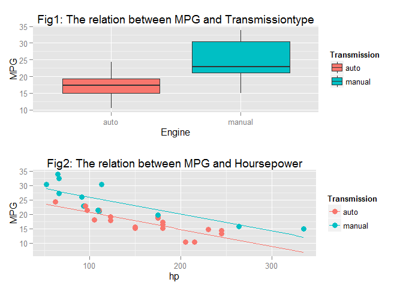
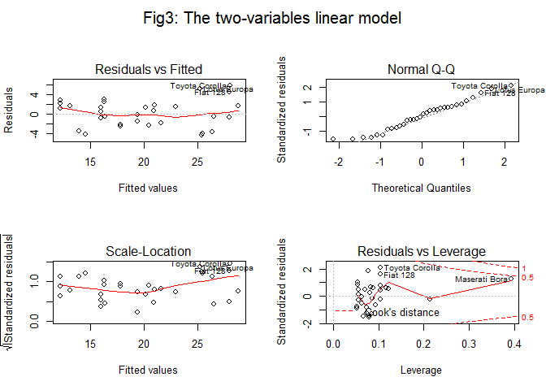

# Regression Models Course Project
CHLin  

## Synopsis


```r
Sys.setlocale("LC_ALL", "C")
data(mtcars)
data = mtcars
```

The `mtcars` data was extracted from the 1974 Motor Trend US magazine, and comprises fuel consumption and 10 aspects of automobile design and performance for 32 automobiles (1973-74 models). The dataset contains with 32 observations on 11 variables.

1. [, 1]  mpg	Miles/(US) gallon
2. [, 2]	cyl	Number of cylinders
3. [, 3]	disp	Displacement (cu.in.)
4. [, 4]	hp	Gross horsepower
5. [, 5]	drat	Rear axle ratio
6. [, 6]	wt	Weight (lb/1000)
7. [, 7]	qsec	1/4 mile time
8. [, 8]	vs	V/S
9. [, 9]	am	Transmission (0 = automatic, 1 = manual)
10. [,10]	gear	Number of forward gears
11. [,11]	carb	Number of carburetors

The dataset is provided by Henderson and Velleman (1981), Building multiple regression models interactively. Biometrics, 37, 391-411.


```r
str(mtcars)
```

```
## 'data.frame':	32 obs. of  11 variables:
##  $ mpg : num  21 21 22.8 21.4 18.7 18.1 14.3 24.4 22.8 19.2 ...
##  $ cyl : num  6 6 4 6 8 6 8 4 4 6 ...
##  $ disp: num  160 160 108 258 360 ...
##  $ hp  : num  110 110 93 110 175 105 245 62 95 123 ...
##  $ drat: num  3.9 3.9 3.85 3.08 3.15 2.76 3.21 3.69 3.92 3.92 ...
##  $ wt  : num  2.62 2.88 2.32 3.21 3.44 ...
##  $ qsec: num  16.5 17 18.6 19.4 17 ...
##  $ vs  : num  0 0 1 1 0 1 0 1 1 1 ...
##  $ am  : num  1 1 1 0 0 0 0 0 0 0 ...
##  $ gear: num  4 4 4 3 3 3 3 4 4 4 ...
##  $ carb: num  4 4 1 1 2 1 4 2 2 4 ...
```

In this report, we will answer the two questions:

1. Is an automatic or manual transmission better for MPG
2. Quantify the MPG difference between automatic and manual transmissions

## Analysis and Results

According to the appendix correlation matrix, since `am` has high correlation with `cyl`, `disp`, `drat`, `wt`, and `gear`, we include the independent variables of `am`, `hp`, `vs` , `carb`.  If one check the correlation of the four variables, one can find that `hp` has high correlation with `vs` and `carb`. We also drop the two variables, and therfore we only has two independent variables `am` and `hp`.  Both Fig.1 and Fig.2 show that the manual transmission has better MPG than automatic transmission. 


 

The quantitative MPG difference between automatic and manual transmissions is shown as follow. In this alalysis, we simply apply the linear regression model.


```r
fit = lm(mpg~am + hp, data=data)
summary(fit)
```

```
## 
## Call:
## lm(formula = mpg ~ am + hp, data = data)
## 
## Residuals:
##     Min      1Q  Median      3Q     Max 
## -4.3843 -2.2642  0.1366  1.6968  5.8657 
## 
## Coefficients:
##              Estimate Std. Error t value Pr(>|t|)    
## (Intercept) 26.584914   1.425094  18.655  < 2e-16 ***
## am           5.277085   1.079541   4.888 3.46e-05 ***
## hp          -0.058888   0.007857  -7.495 2.92e-08 ***
## ---
## Signif. codes:  0 '***' 0.001 '**' 0.01 '*' 0.05 '.' 0.1 ' ' 1
## 
## Residual standard error: 2.909 on 29 degrees of freedom
## Multiple R-squared:  0.782,	Adjusted R-squared:  0.767 
## F-statistic: 52.02 on 2 and 29 DF,  p-value: 2.55e-10
```

```r
par(mfrow=c(2, 2),oma=c(0,0,2,0))
plot(fit, sub.caption ="Fig3: The two-variables linear model")
```

 
 
One can find that the Adjusted R-squard is 0.7670, which is the proportion of MPG variance explained in this model.  If one uses all the variables to fit the model, the Adjusted R-squard is 0.8066 as shown in appendix, which is better than the two variables model. However, in the all-variables fitting model, due to the multicollinearity between the variables, there is no significant coefficients and this make the model hard to interpret.

Fig.3 shows that (1) there is no pattern in the the residuals plot, (2) the residuals are close to Gaussian distribution, and (3) there is no significant outlier in the dataset to affect the regression model. In the regression model, one can interpret that the MPG of manual transmission is higher than automatic by 5.2771 Miles/gallon. As the Hoursepower increases by one unit, the MPG drop by 0.0589 Miles/gallon. 

In conclusion, if the other conditions are the same, the two-variables model predict that the MPG in manual transmission is higher than the automatic one by 5.2771 with 95% confidence interval 5.2771 $\pm$ 2.1591.


## Appendix


```r
data = mtcars
data$am1 = NULL
cor(data)
```

```
##             mpg        cyl       disp         hp        drat         wt
## mpg   1.0000000 -0.8521620 -0.8475514 -0.7761684  0.68117191 -0.8676594
## cyl  -0.8521620  1.0000000  0.9020329  0.8324475 -0.69993811  0.7824958
## disp -0.8475514  0.9020329  1.0000000  0.7909486 -0.71021393  0.8879799
## hp   -0.7761684  0.8324475  0.7909486  1.0000000 -0.44875912  0.6587479
## drat  0.6811719 -0.6999381 -0.7102139 -0.4487591  1.00000000 -0.7124406
## wt   -0.8676594  0.7824958  0.8879799  0.6587479 -0.71244065  1.0000000
## qsec  0.4186840 -0.5912421 -0.4336979 -0.7082234  0.09120476 -0.1747159
## vs    0.6640389 -0.8108118 -0.7104159 -0.7230967  0.44027846 -0.5549157
## am    0.5998324 -0.5226070 -0.5912270 -0.2432043  0.71271113 -0.6924953
## gear  0.4802848 -0.4926866 -0.5555692 -0.1257043  0.69961013 -0.5832870
## carb -0.5509251  0.5269883  0.3949769  0.7498125 -0.09078980  0.4276059
##             qsec         vs          am       gear        carb
## mpg   0.41868403  0.6640389  0.59983243  0.4802848 -0.55092507
## cyl  -0.59124207 -0.8108118 -0.52260705 -0.4926866  0.52698829
## disp -0.43369788 -0.7104159 -0.59122704 -0.5555692  0.39497686
## hp   -0.70822339 -0.7230967 -0.24320426 -0.1257043  0.74981247
## drat  0.09120476  0.4402785  0.71271113  0.6996101 -0.09078980
## wt   -0.17471588 -0.5549157 -0.69249526 -0.5832870  0.42760594
## qsec  1.00000000  0.7445354 -0.22986086 -0.2126822 -0.65624923
## vs    0.74453544  1.0000000  0.16834512  0.2060233 -0.56960714
## am   -0.22986086  0.1683451  1.00000000  0.7940588  0.05753435
## gear -0.21268223  0.2060233  0.79405876  1.0000000  0.27407284
## carb -0.65624923 -0.5696071  0.05753435  0.2740728  1.00000000
```

```r
pairs(mpg ~ ., data = data)
```

 


```r
fit2 = lm(mpg~., data=data)
summary(fit2)
```

```
## 
## Call:
## lm(formula = mpg ~ ., data = data)
## 
## Residuals:
##     Min      1Q  Median      3Q     Max 
## -3.4506 -1.6044 -0.1196  1.2193  4.6271 
## 
## Coefficients:
##             Estimate Std. Error t value Pr(>|t|)  
## (Intercept) 12.30337   18.71788   0.657   0.5181  
## cyl         -0.11144    1.04502  -0.107   0.9161  
## disp         0.01334    0.01786   0.747   0.4635  
## hp          -0.02148    0.02177  -0.987   0.3350  
## drat         0.78711    1.63537   0.481   0.6353  
## wt          -3.71530    1.89441  -1.961   0.0633 .
## qsec         0.82104    0.73084   1.123   0.2739  
## vs           0.31776    2.10451   0.151   0.8814  
## am           2.52023    2.05665   1.225   0.2340  
## gear         0.65541    1.49326   0.439   0.6652  
## carb        -0.19942    0.82875  -0.241   0.8122  
## ---
## Signif. codes:  0 '***' 0.001 '**' 0.01 '*' 0.05 '.' 0.1 ' ' 1
## 
## Residual standard error: 2.65 on 21 degrees of freedom
## Multiple R-squared:  0.869,	Adjusted R-squared:  0.8066 
## F-statistic: 13.93 on 10 and 21 DF,  p-value: 3.793e-07
```
