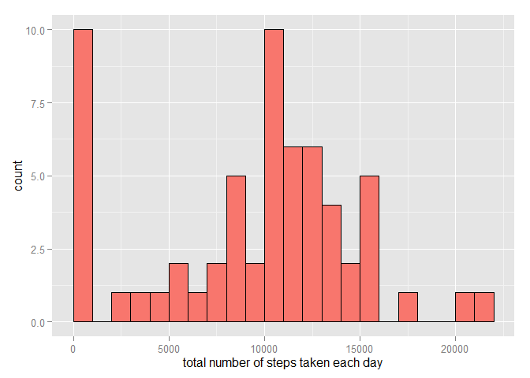
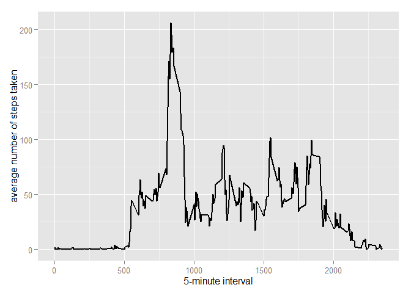
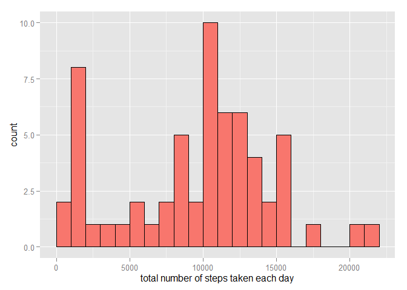
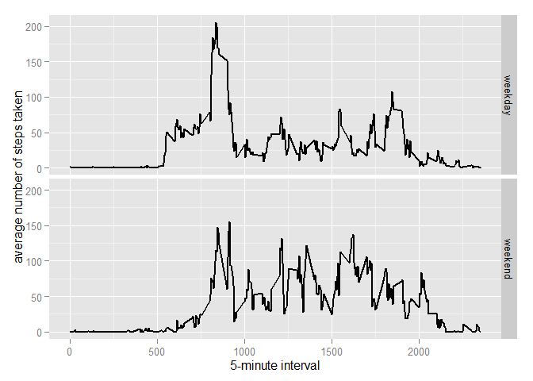

# Reproducible Research: Peer Assessment 1

## Loading and preprocessing the data


```r
Sys.setlocale("LC_ALL", "C")
data = read.csv("activity.csv")
```

## What is mean total number of steps taken per day?

#### 1. Calculate the total number of steps taken per day


```r
steps = tapply(data$steps, data$date, sum, na.rm = TRUE)
date = names(steps)
steps = as.data.frame(unname(steps))
colnames(steps) = "steps"
steps$date = as.factor(date)
head(steps)
```

```
##   steps       date
## 1     0 2012-10-01
## 2   126 2012-10-02
## 3 11352 2012-10-03
## 4 12116 2012-10-04
## 5 13294 2012-10-05
## 6 15420 2012-10-06
```

#### 2. Make a histogram of the total number of steps taken each day


```r
library(ggplot2)
ggplot(steps, aes(x=steps)) +
  geom_histogram(colour="black",binwidth = 1000, aes(fill="red")) + 
  scale_x_continuous("total number of steps taken each day", limits=c(0,22000)) + 
  guides(fill=FALSE)
```

 

#### 3. Calculate and report the mean and median of the total number of steps taken per day
**Mean**

```r
mean(steps$steps, na.rm=TRUE) # 9354.23
```

```
## [1] 9354.23
```
**Median**

```r
median(steps$steps, na.rm=TRUE) # 10395
```

```
## [1] 10395
```

## What is the average daily activity pattern?
#### 1. Make a time series plot (i.e. type = "l") of the 5-minute interval (x-axis) and the average number of steps taken, averaged across all days (y-axis)


```r
# data processing
IntervalSteps = tapply(data$steps, data$interval, mean, na.rm = TRUE)
interval = names(IntervalSteps)
IntervalSteps = as.data.frame(unname(IntervalSteps))
colnames(IntervalSteps) = "steps"
IntervalSteps$interval = as.numeric(interval)

# plot
ggplot(data=IntervalSteps, aes(x=interval, y=steps)) +
  geom_line(size=1)+
  xlab("5-minute interval") +
  ylab("average number of steps taken")
```

 

#### 2. Which 5-minute interval, on average across all the days in the dataset, contains the maximum number of steps?


```r
MAX.Interval = IntervalSteps$interval[which.max(IntervalSteps$steps)]  # 835
MAX.Step = max(IntervalSteps$steps)  # 206.1698113
MAX.Interval
```

```
## [1] 835
```
The interval containing the average maximum number of steps is **835** and the Average Max Steps is **206.1698113**.

## Imputing missing values

#### 1. Calculate and report the total number of missing values in the dataset (i.e. the total number of rows with NAs)


```r
# total number of rows with NAs
sum(is.na(data$steps))
```

```
## [1] 2304
```

#### 2. Devise a strategy for filling in all of the missing values in the dataset. The strategy does not need to be sophisticated. For example, you could use the mean/median for that day, or the mean for that 5-minute interval, etc.
**All of the missing values are filled in with median value for that 5-minute interval.**


```r
# make a data.frame: median of steps
Median = tapply(data$steps, data$interval, median, na.rm = TRUE)
interval = names(Median)
Median = as.data.frame(unname(Median))
colnames(Median) = "steps"
Median$interval = as.numeric(interval)

# merge this Median data.frame with the origin data
dummy = merge(data, Median,by="interval")
dummy = dummy[order(dummy$date),]
```

#### 3. Create a new dataset that is equal to the original dataset but with the missing data filled in.


```r
# create a new dataset called data2
data2 = data
# filling the NA with Median values
RowNAIndex = is.na(data$steps)
data2[RowNAIndex,1] = dummy[RowNAIndex,"steps.y"]
```

#### 4. Make a histogram of the total number of steps taken each day and Calculate and report the mean and median total number of steps taken per day. Do these values differ from the estimates from the first part of the assignment? What is the impact of imputing missing data on the estimates of the total daily number of steps?


```r
# Calculate the total number of steps taken per day
steps = tapply(data2$steps, data2$date, sum, na.rm = TRUE)
date = names(steps)
steps = as.data.frame(unname(steps))
colnames(steps) = "steps"
steps$date = as.factor(date)
head(steps)
```

```
##   steps       date
## 1  1141 2012-10-01
## 2   126 2012-10-02
## 3 11352 2012-10-03
## 4 12116 2012-10-04
## 5 13294 2012-10-05
## 6 15420 2012-10-06
```

```r
# plot
ggplot(steps, aes(x=steps)) +
  geom_histogram(colour="black",binwidth = 1000, aes(fill="red")) + 
  scale_x_continuous("total number of steps taken each day", limits=c(0,22000)) + 
  guides(fill=FALSE)
```

 

```r
# Mean
mean(steps$steps, na.rm=TRUE)
```

```
## [1] 9503.869
```

```r
# Median
median(steps$steps, na.rm=TRUE)
```

```
## [1] 10395
```

**Compared to the first part of the assignment, *the Mean is different but the Median is the same*. This result is consistent with my imputing missing data strategy--  filling in all of the missing values by Median.**

## Are there differences in activity patterns between weekdays and weekends?

#### 1. Create a new factor variable in the dataset with two levels- `weekday` and `weekend` indicating whether a given date is a weekday or weekend day.


```r
data2$date = strptime(data2$date, "%Y-%m-%d")
data2$weekend = as.numeric(weekdays(data2$date) %in% c('Saturday','Sunday'))
data2$weekend = as.factor(data2$weekend)

library(plyr)
data2$weekend = revalue(data2$weekend, c("0"="weekday", "1"="weekend"))

library(dplyr)
data2 %>%
  select(steps,interval,weekend)%>%
  group_by(interval,weekend) %>%
  summarise(avg_step = mean(steps)) -> Steps
```

#### 2. Make a panel plot containing a time series plot (i.e. type = "l") of the 5-minute interval (x-axis) and the average number of steps taken, averaged across all weekday days or weekend days (y-axis). See the README file in the GitHub repository to see an example of what this plot should look like using simulated data.


```r
ggplot(data=Steps, aes(x=interval, y=avg_step)) +
  geom_line(size=1)+
  facet_grid(weekend ~ .) +
  xlab("5-minute interval") +
  ylab("average number of steps taken")
```

 
