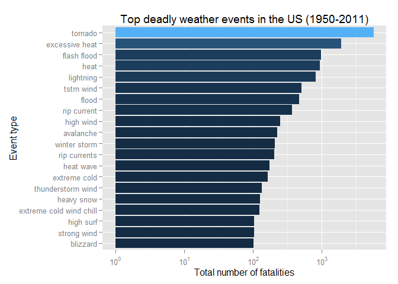
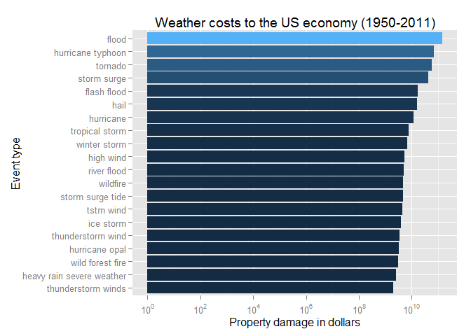
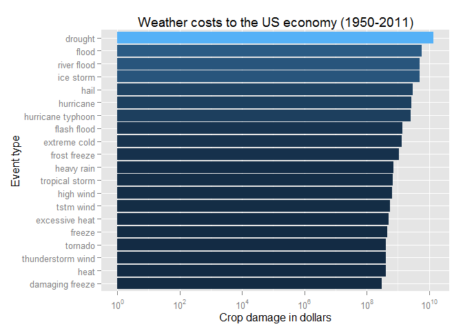

# Impact of Weather Events on Public Health and Economics in US

## Synopsis
Storms and other severe weather events can cause both public health and economic problems for communities and municipalities. Many severe events can result in fatalities, injuries, and property damage, and preventing such outcomes to the extent possible is a key concern. This project involves exploring the U.S. National Oceanic and Atmospheric Administration's (NOAA) storm dataset. The results show that `tornado` is the most harmful weather event to public health. As for the economic loss, `flood` causes the largest property loss and `drought`  makes the largest crop damage.

## Data Processing
The events in the dataset start in the year 1950 and end in November 2011. In the earlier years of the dataset there are generally fewer events recorded, most likely due to a lack of good records. More recent years should be considered more complete. The data used in this report are available [here](https://d396qusza40orc.cloudfront.net/repdata%2Fdata%2FStormData.csv.bz2) [47Mb].  


After loading data from bzip2 file, one can find that the types of events are stored in **`EVTYPE`** variable,the fatalities are stored in **`FATALITIES`**, the injuries are stored in **`INJURIES`**, the property damage is stored in **`PROPDMG`** and **`PROPDMGEXP`**, and the crop damage is stored in **`CROPDMG `** and **`CROPDMGEXP`**.


```r
Sys.setlocale("LC_ALL", "C")
data = read.csv(bzfile("repdata-data-StormData.csv.bz2"),stringsAsFactors=FALSE)
```

Before analysis, we convert the items in **`EVTYPE`** to lowercase and replace all punctuation and characters with a space.


```r
data2 = data
# before processing
length(unique(data2$EVTYPE)) 
```

```
## [1] 985
```


```r
data2$EVTYPE = tolower(data2$EVTYPE)
data2$EVTYPE = gsub("[[:blank:][:punct:]+]", " ", data2$EVTYPE)
# after processing
length(unique(data2$EVTYPE)) 
```

```
## [1] 874
```

One can see that after the pre-processing, the number of unique event types reduce significantly(985 V.S. 874).

 
In addtion to pre-processing `EVTYPE`, we also need to deal with the exponents of `PROPDMGEXP` and `CROPDMGEXP`. The exponents of `PROPDMGEXP` and `CROPDMGEXP` are shown as follow.


```r
# PROPDMGEXP
unique(data2$PROPDMGEXP)
```

```
##  [1] "K" "M" ""  "B" "m" "+" "0" "5" "6" "?" "4" "2" "3" "h" "7" "H" "-"
## [18] "1" "8"
```

```r
# CROPDMGEXP
unique(data2$CROPDMGEXP)
```

```
## [1] ""  "M" "K" "m" "B" "?" "0" "k" "2"
```

To deal with this exponent issue, we build a `Converter` function to transfer the exponent into a number.


```r
Converter <- function(e) {
  # h -> hundred, k -> thousand, m -> million, b -> billion
  if (e %in% c('h', 'H'))
    return(2)
  else if (e %in% c('k', 'K'))
    return(3)
  else if (e %in% c('m', 'M'))
    return(6)
  else if (e %in% c('b', 'B'))
    return(9)
  else if (!is.na(as.numeric(e))) # if a digit
    return(as.numeric(e))
  else 
    return(0)
}
```

## Results

### How Weather Events affect Public Health

Here is the top 20 events of the highest fatalities. 

```r
# weather events causes death
FATALITIES = head(sort(tapply(data2$FATALITIES,data2$EVTYPE, sum),decreasing=TRUE), n=20)
FATALITIES = data.frame("Event"=names(FATALITIES),"Fatalities"=unname(FATALITIES))
FATALITIES
```

```
##                      Event Fatalities
## 1                  tornado       5633
## 2           excessive heat       1903
## 3              flash flood        978
## 4                     heat        937
## 5                lightning        816
## 6                tstm wind        504
## 7                    flood        470
## 8              rip current        368
## 9                high wind        248
## 10               avalanche        224
## 11            winter storm        206
## 12            rip currents        204
## 13               heat wave        172
## 14            extreme cold        162
## 15       thunderstorm wind        133
## 16              heavy snow        127
## 17 extreme cold wind chill        125
## 18               high surf        104
## 19             strong wind        103
## 20                blizzard        101
```


```r
library(ggplot2)
library(scales)

ggplot(data=FATALITIES,
             aes(x=reorder(Event,Fatalities), y=Fatalities, fill=Fatalities)) +
  geom_bar(stat="identity") +
  coord_flip() +
  ylab("Total number of fatalities") +
  xlab("Event type") +
  theme(legend.position="none") + 
  ggtitle("Top deadly weather events in the US (1950-2011)") +
  scale_y_log10(breaks = 
                  trans_breaks("log10", function(x) 10^x), labels = trans_format("log10", math_format(10^.x)))
```

 

Here is the top 20 events of the highest injuries.

```r
# weather events causes injuries
INJURIES = head(sort(tapply(data2$INJURIES,data2$EVTYPE, sum),decreasing = TRUE), n=20)
INJURIES = data.frame("Event"=names(INJURIES),"Injuries"=unname(INJURIES))
INJURIES
```

```
##                 Event Injuries
## 1             tornado    91346
## 2           tstm wind     6957
## 3               flood     6789
## 4      excessive heat     6525
## 5           lightning     5230
## 6                heat     2100
## 7           ice storm     1975
## 8         flash flood     1777
## 9   thunderstorm wind     1488
## 10               hail     1361
## 11       winter storm     1321
## 12  hurricane typhoon     1275
## 13          high wind     1137
## 14         heavy snow     1021
## 15           wildfire      911
## 16 thunderstorm winds      908
## 17           blizzard      805
## 18                fog      734
## 19   wild forest fire      545
## 20         dust storm      440
```


**It is obvious that the tornado is the most harmful weather event to population health, which causes more than 5,000 death and  more than 10,000 injuries in the last 60 years.** 


### How Weather Events affect Economics

First, we combine the damage loss and the damage loss exponent together, i.e. $$PROPDMG^{PROPDMGEXP}\ \ and\ \    CROPDMG^{CROPDMGEXP},$$ to get the total loss in dollars. 


```r
PROPDMGEXP <- sapply(data2$PROPDMGEXP, Converter)
data2$PROPDMG <- data2$PROPDMG*(10^unname(PROPDMGEXP))
CROPDMGEXP <- sapply(data2$CROPDMGEXP, Converter)
data2$CROPDMG <- data2$CROPDMG * (10^unname(CROPDMGEXP))
```


Here is the top 20 events of the highest property damage. 

```r
# weather events causes death
PROPDMG = head(sort(tapply(data2$PROPDMG,data2$EVTYPE, sum),decreasing=TRUE), n=20)
PROPDMG = data.frame("Event"=names(PROPDMG),"PROPDMG"=unname(PROPDMG))
PROPDMG
```

```
##                        Event      PROPDMG
## 1                      flood 144657709807
## 2          hurricane typhoon  69305840000
## 3                    tornado  56947380677
## 4                storm surge  43323536000
## 5                flash flood  16822673979
## 6                       hail  15735267513
## 7                  hurricane  11868319010
## 8             tropical storm   7703890550
## 9               winter storm   6688497251
## 10                 high wind   5270046295
## 11               river flood   5118945500
## 12                  wildfire   4765114000
## 13          storm surge tide   4641188000
## 14                 tstm wind   4484958495
## 15                 ice storm   3944927860
## 16         thunderstorm wind   3483122472
## 17            hurricane opal   3172846000
## 18          wild forest fire   3001829500
## 19 heavy rain severe weather   2500000000
## 20        thunderstorm winds   1944590859
```


```r
ggplot(data=PROPDMG,
             aes(x=reorder(Event,PROPDMG), y=PROPDMG, fill=PROPDMG)) +
  geom_bar(stat="identity") +
  coord_flip() +
  ylab("Property damage in dollars") +
  xlab("Event type") +
  theme(legend.position="none") + 
  ggtitle("Weather costs to the US economy (1950-2011)") +
  scale_y_log10(breaks = 
                  trans_breaks("log10", function(x) 10^x), labels = trans_format("log10", math_format(10^.x)))
```

 

Here is the top 20 events of the highest crop damage.

```r
# weather events causes injuries
CROPDMG = head(sort(tapply(data2$CROPDMG,data2$EVTYPE, sum),decreasing = TRUE), n=20)
CROPDMG = data.frame("Event"=names(CROPDMG),"CROPDMG"=unname(CROPDMG))
CROPDMG
```

```
##                Event     CROPDMG
## 1            drought 13972566000
## 2              flood  5661968450
## 3        river flood  5029459000
## 4          ice storm  5022113500
## 5               hail  3025954473
## 6          hurricane  2741910000
## 7  hurricane typhoon  2607872800
## 8        flash flood  1421317100
## 9       extreme cold  1312973000
## 10      frost freeze  1094186000
## 11        heavy rain   733399800
## 12    tropical storm   678346000
## 13         high wind   638571300
## 14         tstm wind   554007350
## 15    excessive heat   492402000
## 16            freeze   456725000
## 17           tornado   414953270
## 18 thunderstorm wind   414843050
## 19              heat   401461500
## 20   damaging freeze   296230000
```


```r
ggplot(data=CROPDMG,
             aes(x=reorder(Event,CROPDMG), y=CROPDMG, fill=CROPDMG)) +
  geom_bar(stat="identity") +
  coord_flip() +
  ylab("Crop damage in dollars") +
  xlab("Event type") +
  theme(legend.position="none") + 
  ggtitle("Weather costs to the US economy (1950-2011)") +
  scale_y_log10(breaks = 
                  trans_breaks("log10", function(x) 10^x), labels = trans_format("log10", math_format(10^.x)))
```

 

**The figures show that the flood causes the largest property loss while the drought makes the largest crop damage.** 
