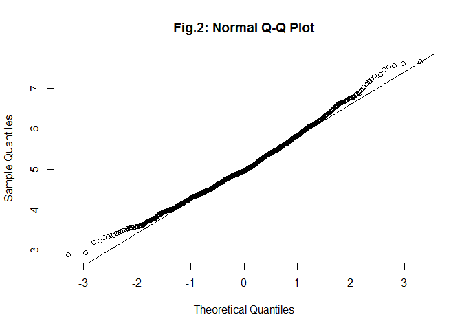

# Coursera Statistical Inference Project Part 1: A Simulation Exercise
CHLin  

## Overview
In this project, we will compare the Central Limit Theorem with the averages of 40 [exponential distributions](http://en.wikipedia.org/wiki/Exponential_distribution). The parameter lambda of the exponetial distribution is set to 0.2 and the number of iteration is 1000.

## Simulations and Results

The following codes are used to generate the simulation results. The meansof 40 exponential distributions are saved in `MeanRes` with dimensions 1x1000.     


```r
Sys.setlocale("LC_ALL", "C")
lambda = 0.2
N_variable = 40
N_AV = 1000
ExpMatrix = matrix(rexp(N_variable*N_AV, lambda), nrow = N_AV, ncol = N_variable)
MeanRes = rowMeans(ExpMatrix)
```


 

The mean of the distribution in Fig.1 is located at 5.05 and the theoretical mean is 5. The variance of the distribution is 0.631  and the theoretical variance is 0.625.

One can make investigation the deviation between the simulation distribution and Central Limit Theorem  by drawing `qqplot`.

```r
qqnorm(MeanRes, main="Fig.2: Normal Q-Q Plot")
qqline(MeanRes)
```

 

Fig. 2 shows that the Central Limit Theorem is not a good approximation when the quantiles are small or large. This means that the deviation of the tail regions are larger than the central region.

To further check whether the distribution in Fig. 1 is a Gaussian distribution, one can use [Kolmogorov–Smirnov Statistic](http://en.wikipedia.org/wiki/Kolmogorov%E2%80%93Smirnov_test) to compare the distance of two distributions.  


```r
library(dgof)
```

```r
CumulativeGaussian = pnorm(length(MeanRes),mean(MeanRes),sd(MeanRes))
test = ks.test(MeanRes, CumulativeGaussian)
test
```

```
## 
## 	Two-sample Kolmogorov-Smirnov test
## 
## data:  MeanRes and CumulativeGaussian
## D = 1, p-value = 0.001998
## alternative hypothesis: two-sided
```

The ks.test rejects the null hypothesis (significant level .05) that the distribution in Fig. 1 is a Gaussian distribution with p-values: 0.001998, which is consistent with tailing effect of small/large quantiles in Fig.2 . Therefore, we cannot approximate the simulation results as a Gaussian distribution. 
