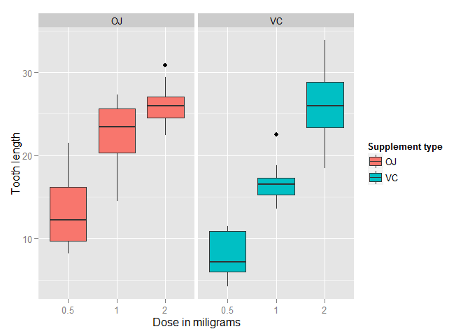

# Coursera Statistical Inference Project Part 2: Basic Inferential Data Analysis
CHLin  

The ToothGrowth(Datasets) describes the response of the length of odontoblasts (teeth) in each of 10 guinea pigs at each of three dose levels of Vitamin C (0.5, 1, and 2 mg) with each of two delivery methods (orange juice or ascorbic acid). The data contain 60 observations on 3 variables, 

1. [,1]  len	numeric	Tooth length,
2. [,2]  supp	factor	Supplement type (VC or OJ),
3. [,3]  dose	numeric	Dose in milligrams.

In this project, we will use the hypothesis tests to compare tooth growth by supplement and dose.


First, we need to simply visualize the data to get the properties of the parameters. The following code plots the data with ggplot2 package. 


```r
library(datasets)
library(ggplot2)
ggplot(data=ToothGrowth, aes(x=as.factor(dose), y=len, fill=supp)) +
  geom_boxplot() +
  facet_grid(. ~ supp) +
  xlab("Dose in miligrams") +
  ylab("Tooth length") +
  guides(fill=guide_legend(title="Supplement type"))
```

 

The boxplot shows that the tooth lenght has positive correlation with the dosage of both supplements(VC/OJ).
The summary table is shown as followed.


```r
library(dplyr)
ToothGrowth %>%
  group_by(supp,dose) %>%
  summarise(Q25th_len = quantile(len,0.25),
            Q50th_len = quantile(len,0.5),
            Q75th_len = quantile(len,0.75),
            avg_len = mean(len),            
            sd_len = sd(len)) -> data
data
```

```
## Source: local data frame [6 x 7]
## Groups: supp
## 
##   supp dose Q25th_len Q50th_len Q75th_len avg_len   sd_len
## 1   OJ  0.5     9.700     12.25    16.175   13.23 4.459709
## 2   OJ  1.0    20.300     23.45    25.650   22.70 3.910953
## 3   OJ  2.0    24.575     25.95    27.075   26.06 2.655058
## 4   VC  0.5     5.950      7.15    10.900    7.98 2.746634
## 5   VC  1.0    15.275     16.50    17.300   16.77 2.515309
## 6   VC  2.0    23.375     25.95    28.800   26.14 4.797731
```

We can study the relations between `len` and `supp` and `dose` by using t hypothesis test. The following table shows the t-test results combined with p-value and confidence intervals.


```r
tests = list()
dose = c(0.5,1,2)
for (d in dose) {
  ojd = ToothGrowth$len[ToothGrowth$dose == d & ToothGrowth$supp == "OJ"]
  vcd = ToothGrowth$len[ToothGrowth$dose == d & ToothGrowth$supp == "VC"]
  t <- t.test(ojd, vcd)
  id <- paste0("OJ","-", "VC",",",d)
  tests <- rbind(tests, list(id=id, p.value=t$p.value, conf.lo=t$conf.int[1], conf.hi=t$conf.int[2]))
}
tests
```

```
##      id          p.value     conf.lo  conf.hi 
## [1,] "OJ-VC,0.5" 0.006358607 1.719057 8.780943
## [2,] "OJ-VC,1"   0.001038376 2.802148 9.057852
## [3,] "OJ-VC,2"   0.9638516   -3.79807 3.63807
```

From the t-test results, we need to reject the following hypotheses:

1. The difference of mean-value between OJ and VC in dose 0.5 is zero.
2. The difference of mean-value between OJ and VC in dose 1.0 is zero.

We cannot distinguish the difference between OJ and VC in dose 2. Therefore, we can conclude that in dose 0.5 and dose 1, the tooth length with OJ supplement is longer than that with VC. However, in dose 2, the tooth length with OJ and VC supplements does not have significant difference.
